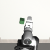
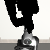

# Shadow: Calibration-Robust Cross-Embodiment Policy Transfer

Independent reproduction and extension of **SHADOW: Leveraging Segmentation Masks for Cross-Embodiment Policy Transfer** (Lepert, Doshi, Bohg — CoRL 2024) · [paper](https://arxiv.org/abs/2503.00774) · [project page](https://shadow-cross-embodiment.github.io).

## TL;DR

Shadow is a data-editing scheme that lets a Diffusion Policy trained on one robot transfer zero-shot to a different robot, by replacing the source-robot pixels in each frame with a rendered silhouette of the target robot at the same end-effector pose. The original paper names one stated limitation: Shadow degrades sharply under camera calibration error, since the rendered target mask becomes misaligned with the actual scene (Appendix A.4, Table 3 — success rate 0.98 → 0.20 with 2 cm / 10° extrinsic noise on the Mug task). The authors note in future work that *"we could attempt to render Shadow more robust to camera calibration error via (modest) noise injection during training."* This repo runs that experiment.

We independently reproduce Shadow on the **Stack** task (Mimicgen, 951 demos) and characterize how cross-embodiment performance degrades with eval-time calibration noise — first under the paper's vanilla training, then under our calibration-noise-injected variant. The headline question: **can we recover the cross-embodiment performance lost to imperfect calibration?**

> No public code release for Shadow exists at the time of writing — this is an independent reproduction from the paper alone.

## Pipeline visualization

| Source frame (Panda doing Stack) | Shadow-edited frame (Panda blacked out + Sawyer silhouette overlaid) |
|---|---|
|  |  |

Frames pulled from `datasets/shadow/stack_d0_shadow.hdf5` after running `create_shadow_dataset.py`. The original RGB shows a Panda mid-stacking-task; the Shadow-edited frame replaces Panda pixels with black and overlays a Sawyer silhouette at the same end-effector pose. The policy is trained on the right-hand version.

## Method

### Shadow's data edit (faithful reproduction)
Each training image goes through two edits:
1. **Blackout** — pixels belonging to the *source* robot are replaced with solid black, computed from joint angles + URDF geometry + the calibrated camera.
2. **Overlay** — the *target* robot is rendered offscreen at the same end-effector pose (via inverse kinematics) and its silhouette is composited on top of the blacked-out image.

Background, table, and object are preserved as raw RGB. This is **not** a full segmentation map — only the robot region is abstracted. (The "blackout-only, no overlay" variant is the failing baseline in paper Table 1.)

### Our extension: calibration-noise injection
During training, we add Gaussian noise to the camera extrinsics used in the overlay step:
- `Δx ~ N(0, σ_x I)` on translation (meters)
- `Δθ ~ N(0, σ_θ)` on rotation (radians, via random axis-angle perturbation)

The composited image the policy sees has a slightly mis-rendered target mask. The policy learns not to rely on perfect mask alignment. At evaluation, we apply controlled extrinsic noise of varying magnitude and compare against the vanilla Shadow policy.

## Experiment design

| Condition | Training images | Train-time mask noise | Eval (source) | Eval (target) |
|---|---|---|---|---|
| RGB baseline | raw RGB | n/a | Panda | Sawyer |
| Vanilla Shadow | blackout + overlay | none | Panda | Sawyer |
| Shadow + noise (ours) | blackout + noisy overlay | yes | Panda | Sawyer |

Each condition is trained with 3 random seeds. Each policy is evaluated at 5 calibration-noise levels — `{0, 0.5 cm / 2°, 1 cm / 5°, 2 cm / 10°, 4 cm / 20°}` — × 100 rollouts per condition. Error bars come from seed standard deviation.

## Results

*Currently in pipeline build phase. Headline figures will land in `results/` and embed here.*

- `fig_calibration_curve_sawyer.png` — cross-embodiment degradation curves (vanilla vs. ours)
- `fig_calibration_curve_panda.png` — same-robot sanity check
- `fig_mask_examples.png` — visual examples of mask misalignment at each noise level

## Reproduce

See [INSTALL.md](INSTALL.md) for the environment walkthrough. Once installed:

```bash
# Build the Mimicgen Stack dataset, then convert to Shadow-edited variants
python create_shadow_dataset.py --task stack --variant rgb
python create_shadow_dataset.py --task stack --variant shadow_vanilla
python create_shadow_dataset.py --task stack --variant shadow_noise

# Train all three conditions × 3 seeds (cloud GPU recommended)
bash scripts/train_all.sh

# Run the calibration-noise sweep evaluation
python run_calibration_sweep.py \
    --policies rgb,shadow_vanilla,shadow_noise \
    --target_robots Panda,Sawyer

# Generate publication figures
python plot_results.py
```

## Repo layout

```
shadow/
├── README.md                       this file
├── INSTALL.md                      environment setup
├── CLAUDE.md                       project context for Claude Code sessions
├── train.py                        training entrypoint
├── evaluate.py                     evaluation entrypoint
├── create_shadow_dataset.py        Shadow data-edit pipeline (IK + render + composite)
├── run_calibration_sweep.py        calibration-robustness driver
├── run_cross_embodiment.py         cross-embodiment eval driver
├── plot_results.py                 publication figures
├── lib/
│   ├── render_robot_mask.py        URDF-based offscreen rendering
│   └── camera_noise.py             extrinsic-noise sampling
├── configs/                        Diffusion Policy YAML configs
└── results/                        metrics + plots (gitignored)
```

## Status

Active build — code complete, training pending cloud GPU.

- ✅ Local Mac environment (robomimic v0.5 + robosuite v1.5.1 + mimicgen 1.0 + mujoco 3.2.7), with documented compat patches for egl_probe (Linux-only) and a `SingleArmEnv` shim for mimicgen.
- ✅ Stack_D0 Mimicgen dataset downloaded (1000 demos, 1.1 GB).
- ✅ Shadow data-edit pipeline (two-pass IK + segmentation render + composite). Verified end-to-end on a 2-demo smoke run: ~28% of pixels masked at 84×84, mask fractions stable across timesteps.
- ✅ Training entrypoint (`train.py`) + Diffusion Policy config matching paper Table 5 hyperparameters.
- ✅ Evaluation, calibration-noise sweep, cross-embodiment, and plotting scripts.
- ✅ Colab Pro launcher notebook in `scripts/launch_colab.ipynb`.
- ⏳ **Cloud GPU training** — 9 runs (3 variants × 3 seeds), ≈ 60–90 GPU-hours total. Launch from the Colab notebook.
- ⏳ **Live Shadow rendering during eval rollouts** — needs a mujoco-direct silhouette path that doesn't share a GL context with the rollout env. Tracked as `lib/mj_silhouette.py` TODO; not blocking training.
- ⏳ Headline figure (`results/fig_calibration_curve.png`) drops in once eval rollouts complete.


## Citation

```bibtex
@inproceedings{lepert2024shadow,
  title     = {SHADOW: Leveraging Segmentation Masks for Cross-Embodiment Policy Transfer},
  author    = {Lepert, Marion and Doshi, Ria and Bohg, Jeannette},
  booktitle = {Conference on Robot Learning (CoRL)},
  year      = {2024}
}
```

## Acknowledgments

Independent reproduction; no affiliation with the original authors. All errors are mine.
